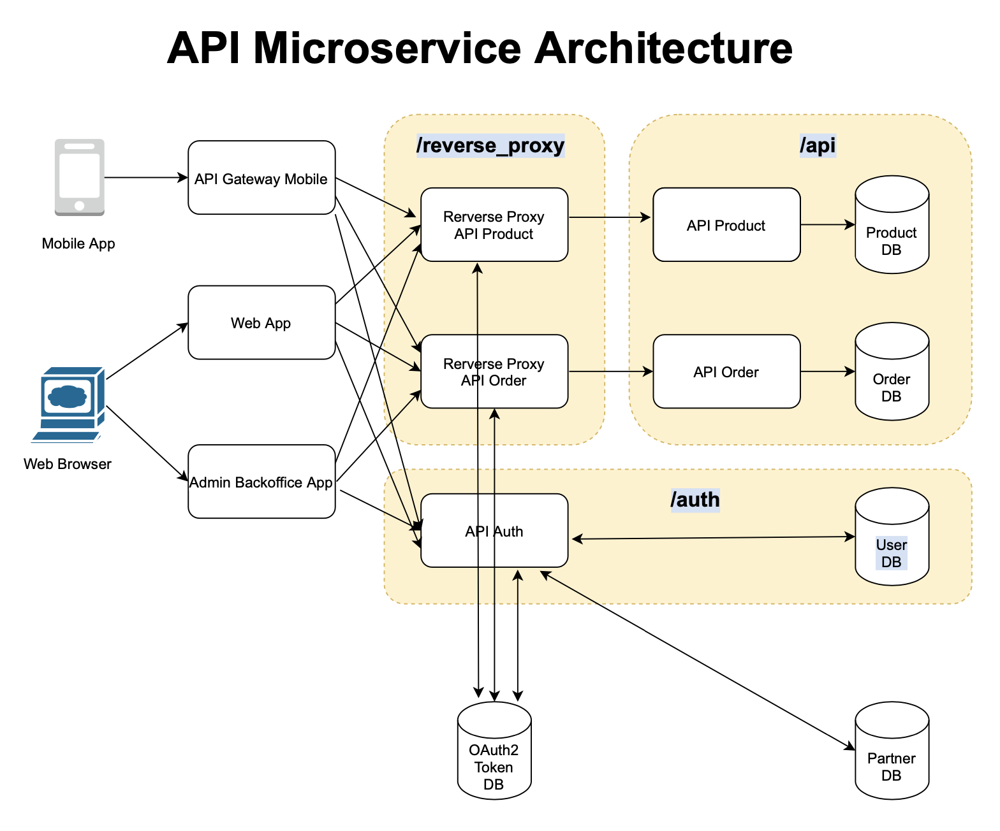

## API Authorization Check through Reverse Proxy

In microservice architecture, API authentication and authorization are best done
through a separate standalone server. This is for scalability purpose and to
simplify the multi-level complexities.

A good solution is to build a reverse-proxy which every API requests (excluding login)
must go through before being able to reach the intended API.

This way, each API microservice doesn't need to care about the authorization. We can
set the authorization rule on the reverse-proxy so that it can remove unwanted
requests before it reaches API servers. Reverse Proxy is designed to be very light,
thus will process each request very fast. Either it will reject the request due
to improper authorization or will forward the request to the appropriate API endpoints
if authorization goes through.

I use Python Flask as the reverse proxy server's framework, because it's a light platform,
quite robust and relatively easy to setup.

To simulate the authentication and authorisation scenario, there are 3 main directories
in the source code:
1. `/api` is where mock API server codes are located
2. `/auth` is where login and authentication-related process happens. This example is using OAuth2 Authorization Code flow to generate Access Token
3. `/reverse_proxy` is the frontline reverse_proxy server code base

Below is the architecture diagram:

Each of the 3 directories is a Flask server running in a standalone Docker container.

The REST API controller codes can be found here:
- /api/app.py
- /auth/app.py
- /reverse_proxy/app.py

## API Authorization Flow from a 3rd Party (Partner) Site
Note that the authentication and authorization flow is using OAuth2 authorization code flow.

1. First, user in a 3rd party (a Partner) site must login to our system by calling our /auth API
2. After logging in, an OAuth2Token that contains unique auth_code and access_token is created
3. The generated OAuth2Token also contains the permission scopes unique for that user. The scopes are copied from user's Partner scopes
4. When user is calling our API, the endpoints will be a Reverse Proxy endpoint
5. User makes an API request to the Reverse Proxy with Access Token embedded in the HTTP Authorization header
6. The Reverse Proxy will check whether the owner of the access_token match with the API requestor
7. If match and API is included in the access_token scopes, then Reverse Proxy will forward the requests to the intended API endpoint
8. When receiving the response, Reverse Proxy will forward it back to the user
9. If access_token doesn't match or API is not within the access_token scopes, Reverse Proxy will return Error back to the user without forwarding the request to the API endpoint

## How to Setup

Use docker-compose to build and run the container. Below are the steps for each server.
(Note that I am using an older version of Docker, thus the long build command)

### 1. Auth Service
1. `docker-compose up oauth2-token-db-dev` to setup the database
2. `COMPOSE_DOCKER_CLI_BUILD=1 DOCKER_BUILDKIT=1 docker-compose build auth-dev` to build the image
3. `docker-compose up auth-dev` to run the container
4. `docker exec -it auth-dev flask db upgrade` to build the DB schema

Address for this service is 0.0.0.0:80

### 2. API Service
There are 2 API services in the simulation. One is for Products API, the other is
for Orders API. The 2 services have internal address, we don't need to access this.
We only need to access the address of this API's related Proxy Server

##### Products API Service
1. `COMPOSE_DOCKER_CLI_BUILD=1 DOCKER_BUILDKIT=1 docker-compose build products-api-dev`
2. `docker-compose up products-api-dev`

Address for this service: internal

##### Orders API Service
1. `COMPOSE_DOCKER_CLI_BUILD=1 DOCKER_BUILDKIT=1 docker-compose build orders-api-dev`
2. `docker-compose up orders-api-dev`

Address for this service: internal

### 3. Reverse Proxy Server
This is the API endpoint for the API requests. There are 2 provy services, each for
its corresponding API.

##### Products API Reverse Proxy
1. `COMPOSE_DOCKER_CLI_BUILD=1 DOCKER_BUILDKIT=1 docker-compose build products-reverse-proxy-dev`
2. `docker-compose up products-reverse-proxy-dev`

Address for this service is `0.0.0.0:1001`. To call Products API Service, would need to make a request to this endpoint

##### Orders API Reverse Proxy
1. `COMPOSE_DOCKER_CLI_BUILD=1 DOCKER_BUILDKIT=1 docker-compose build orders-reverse-proxy-dev`
2. `docker-compose up orders-reverse-proxy-dev`

Address for this service is `0.0.0.0:1002`. To call Orders API Service, would need to make a request to this endpoint

## Documents

Documents for this architecture can be found [here](./docs)

## How to Test
1. Run the `auth-dev` container (look at 1. Auth Service)
2. Run the test database container: `docker-compose up oauth2-token-db-test`
3. Run the test: `docker exec -it auth-dev pytest -v tests/`

